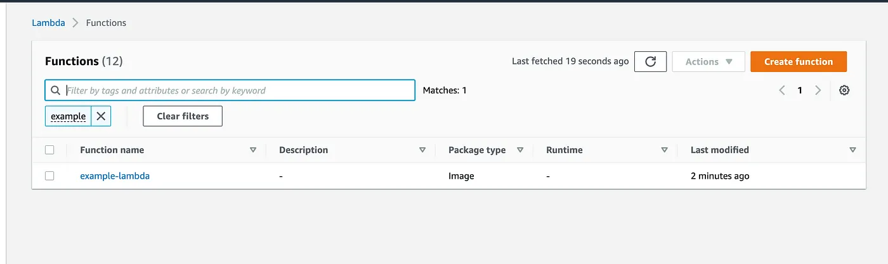
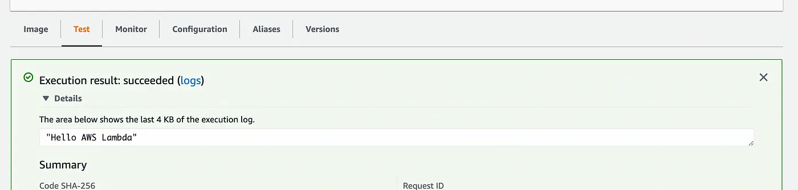

# Outline

-   Terraform
    -   ECR Repository
    -   Null Resource
    -   Lambda
        -   Role
        -   Provider
-   Docker
    -   Application
    -   Requirements
    -   Dockerfile
    -   Uploading to ECR
-   CI/CD Pipeline
    -   Github Actions

## Terraform

### ECR Repository

Let’s start with the ECR repository resource. It’s fairly straightforward, all
we really need to do is specify the name we want our repository to have. Tags
are optional, but I like to add them to any resources I create — so that I can
filter on tags in my billing console. There are other [optional arguments] in
the Terraform docs.

```t
# ECR repository
resource "aws_ecr_repository" "example" {
  name = "example"
  tags = {
  "project" : "blog-example"
  }
}
```

[optional arguments]: https://registry.terraform.io/providers/hashicorp/aws/latest/docs/resources/ecr_repository

### Null Resource

We will need to create images to upload to this repository. Using Terraform's
null_resource allows us to implement a lifecycle on a resource and the triggers
within it allows us to define a set of values that once updated will cause a
resource to be replaced — in this case we want the resource to be replaced if
there are any changes to our main python file or Dockerfile.

```t
resource "null_resource" "ecr_image" {
  triggers = {
    python_file = md5(file("../app.py"))
    docker_file = md5(file("../Dockerfile"))
  }
}
data "aws_ecr_image" "lambda_image" {
  depends_on = [null_resource.ecr_image]
  repository_name = aws_ecr_repository.example.name
  image_tag       = "latest"
}
```

### Lambda

You may also notice the `:latest` at the end of the URI and this allows our
Lambda to use the latest version of image in ECR. The memory size of this Lambda
is also increased a lot to deal with the intensive machine learning workloads
that it will be carrying out — but this can be changed if your own workload does
not require it.

```t
resource "aws_lambda_function" "example" {
  depends_on = [
    null_resource.ecr_image
  ]
  function_name = "example-lambda"
  architectures = ["arm64"]
  role          = aws_iam_role.lambda.arn
  timeout       = 180
  memory_size   = 10240
  image_uri     = "${aws_ecr_repository.example.repository_url}:latest"
  package_type  = "Image"

  # use this to point to different handlers within
  # the same image, or omit `image_config` entirely
  # if only serving a single Lambda function
  image_config {
    command = ["handlers.lambda_handler"]
  }

}
resource "aws_cloudwatch_log_group" "example_service" {
  name              = "/aws/lambda/example_service"
  retention_in_days = 14
}
```

### Role

we also need to allow our Lambda to communicate with ECR and CloudWatch and so
have to provide an IAM role and associated policy.

```t
resource "aws_iam_role" "lambda" {
  name = "example-lambda-role"
  assume_role_policy = <<EOF
{
 "Version": "2012-10-17",
 "Statement": [
   {
      "Action": "sts:AssumeRole",
      "Principal": {
         "Service": "lambda.amazonaws.com"
      },
       "Effect": "Allow"
   }
 ]
}
EOF
}

data "aws_iam_policy_document" "lambda" {
  statement {
    actions = [
      "logs:CreateLogGroup",
      "logs:CreateLogStream",
      "logs:PutLogEvents"
    ]
    effect    = "Allow"
    resources = ["*"]
    sid       = "CreateCloudWatchLogs"
   }
}

resource "aws_iam_policy" "lambda" {
  name   = "example-lambda-policy"
  path   = "/"
  policy = data.aws_iam_policy_document.lambda.json
}
```

### Provider

We then also need our main Terraform file that specifies where the Terraform
state is stored, the region we are using and our AWS Profile.

```t
terraform {
  backend "s3" {
    bucket = "example-blog-state"
    key    = "blog/terraform.tfstate"
    region = "eu-west-2"
  }
  required_providers {
    aws = {
    source  = "hashicorp/aws"
    version = "~> 3.41"
    }
  }
}
provider "aws" {
  region  = "eu-west-2"
  profile = "default"
}
```

## Docker

### Requirements

```txt
wheel
transformers[torch]==4.10.2
aws-lambda-powertools
```

### Application

```py
"""
Copyright Amazon.com, Inc. or its affiliates. All Rights Reserved.
SPDX-License-Identifier: MIT-0
"""
import json
import torch
from transformers import AutoTokenizer, AutoModelForQuestionAnswering
from aws_lambda_powertools import Metrics, Logger, Tracer
from aws_lambda_powertools.metrics import MetricUnit

# Lambda Powertools Setup
logger = Logger()
tracer = Tracer()
metrics = Metrics()

# Loading Model 1
logger.info('Loading NLP Model 1')
# Set up Tokenizer and Model, looks inside model/ folder
tokenizer1 = AutoTokenizer.from_pretrained("model/")
model1 = AutoModelForQuestionAnswering.from_pretrained("model/")


# Loading Model 2
logger.info('Loading NLP Model 2')
tokenizer2 = AutoTokenizer.from_pretrained("model2/")
model2 = AutoModelForQuestionAnswering.from_pretrained("model2/")


@tracer.capture_lambda_handler
@metrics.log_metrics(capture_cold_start_metric=True)
@logger.inject_lambda_context(log_event=True)
def lambda_handler(event, context):
    body = json.loads(event['body'])
    model_type = body['model_type']
    question = body['question']
    context = body['context']

    if model_type == 'nlp1':
        logger.info('NLP Model Version 1 loaded')
        tokenizer = tokenizer1
        model = model1
    elif model_type == 'nlp2':
        logger.info('NLP Model Version 2 loaded')
        tokenizer = tokenizer2
        model = model2
    else:
        logger.info('No model specified, loading version 1.')
        tokenizer = tokenizer1
        model = model1
        model_type = 'nlp1'

    inputs = tokenizer.encode_plus(question, context,add_special_tokens=True, return_tensors="pt")
    input_ids = inputs["input_ids"].tolist()[0]

    output = model(**inputs)
    answer_start_scores = output.start_logits
    answer_end_scores = output.end_logits

    answer_start = torch.argmax(answer_start_scores)
    answer_end = torch.argmax(answer_end_scores) + 1

    answer = tokenizer.convert_tokens_to_string(tokenizer.convert_ids_to_tokens(input_ids[answer_start:answer_end]))

    print('Question: {0}, Answer: {1}'.format(question, answer))
    return {
        'statusCode': 200,
        'headers': {'Content-Type': 'application/json'},
        'body': json.dumps({
            'Model_Type': model_type,
            'Question': question,
            'Answer': answer
        })
    }
```

### Dockerfile

```Dockerfile

# Pull the base image with python 3.8 as a runtime for your Lambda
FROM public.ecr.aws/lambda/python:3.8

# Copy the requirements for pip + huggingface transformers
COPY requirements.txt ./

# Install the python requirements from requirements.txt
RUN python3.8 -m pip install -r requirements.txt

# Copy the earlier created app.py file to the container
COPY app.py ./

# Load the BERT model from Huggingface and store it in the model directory
RUN mkdir model
RUN curl -L https://huggingface.co/distilbert-base-uncased-distilled-squad/resolve/main/pytorch_model.bin -o ./model/pytorch_model.bin
RUN curl https://huggingface.co/distilbert-base-uncased-distilled-squad/resolve/main/config.json -o ./model/config.json
RUN curl https://huggingface.co/distilbert-base-uncased-distilled-squad/resolve/main/tokenizer.json -o ./model/tokenizer.json
RUN curl https://huggingface.co/distilbert-base-uncased-distilled-squad/resolve/main/tokenizer_config.json -o ./model/tokenizer_config.json

# Load a second model
RUN mkdir model2
RUN curl -L https://huggingface.co/distilbert-base-cased-distilled-squad/resolve/main/pytorch_model.bin -o ./model2/pytorch_model.bin
RUN curl https://huggingface.co/distilbert-base-cased-distilled-squad/resolve/main/config.json -o ./model2/config.json
RUN curl https://huggingface.co/distilbert-base-cased-distilled-squad/resolve/main/tokenizer.json -o ./model2/tokenizer.json
RUN curl https://huggingface.co/distilbert-base-cased-distilled-squad/resolve/main/tokenizer_config.json -o ./model2/tokenizer_config.json

# Set the CMD to your handler
CMD ["app.lambda_handler"]

```

Ok so with with our Terraform code in place, when we run our init , plan and
apply we should see a failure, with the following message:

```sh
Error: Error describing ECR images: ImageNotFoundException: The image with imageId {imageDigest:’null’, imageTag:’latest’} does not exist within the repository with name ‘example’ in the registry with id
```

This is because there is currently no image in ECR yet! Let’s do something about that.

### Uploading to ECR

Here is the regular CLI commands to build and push a docker image to ECR:

```sh

# Log in to ECR
aws ecr get-login-password --region INSERT_REGION | docker login --username AWS --password-stdin INSERT_ACCOUNT_ID.dkr.ecr.INSERT_REGION.amazonaws.com

# Build Docker image
docker build -t example .
# Tag Image
docker tag example:latest INSERT_ACCOUNT_ID.dkr.ecr.INSERT_REGION.amazonaws.com/example:latest

# Push image to ECR
docker push INSERT_ACCOUNT_ID.dkr.ecr.INSERT_REGION.amazonaws.com/example:latest

```

Now we have an image in ECR lets try to run our Terraform again to link the
Lambda to it!

> Note: make sure you are in your Terraform directory when running
> `terraform plan` and `terraform apply` .



In this Lambda once you click on the `Image` tab at the bottom you should see
that its image is being pulled from ECR! You can also configure a test event by
clicking on the `Test` tab and Triggering a test event. Once the Lambda has
executed you should see your response, for example in my case — I can see `Hello
AWS Lambda`!



But if we update this code to say something else how will our Lambda know? If we
push up a new image, will Lambda automatically know to pull the update?

To update the Lambda to pull in the uploaded image, you need to run the
following command:

```sh
aws lambda update-function-code --function-name example-lambda \
--image-uri ${{AWS_ACCOUNT_NUMBER }}.dkr.ecr.eu-west-2.amazonaws.com/example:latest
```

But we don’t want to have to build, tag, push and update our container manually
every time we make a change — so let’s add all these steps to a CI/CD pipeline .

## CI/CD Pipeline

### Github Actions

[Source](https://www.litiverse.com/posts/deploying-docker-image-lambda)

```yaml
# .github/workflows/deploy.yml

name: Deploy
on:
    push:
        branches:
            - main
jobs:
    build_and_push:
        runs-on: ubuntu-latest
        if: contains(github.ref, 'main')
        outputs:
            image_tag: ${{ steps.build_image_step.outputs.image_tag }}

        steps:
            - name: Check out repo
              uses: actions/checkout@v2
            - name: Configure AWS Credentials
              uses: aws-actions/configure-aws-credentials@v1
              with:
                  aws-access-key-id: ${{ secrets.AWS_ACCESS_KEY_ID }}
                  aws-secret-access-key: ${{ secrets.AWS_SECRET_ACCESS_KEY }}
                  aws-region: ${{ secrets.AWS_DEFAULT_REGION }}
            - name: Login to Amazon ECR
              id: login-ecr
              uses: aws-actions/amazon-ecr-login@v1

            - name: Build, tag, and push image to Amazon ECR
              id: build_image_step
              env:
                  ECR_REGISTRY: ${{ steps.login-ecr.outputs.registry }}
                  ECR_REPOSITORY: your-repo-name
                  IMAGE_TAG: ${{ github.sha }}
              run: |
                  docker build --build-arg \
                  -t $ECR_REGISTRY/$ECR_REPOSITORY:$IMAGE_TAG \
                  -t $ECR_REGISTRY/$ECR_REPOSITORY:latest .
                  docker push $ECR_REGISTRY/$ECR_REPOSITORY:$IMAGE_TAG
                  docker push $ECR_REGISTRY/$ECR_REPOSITORY:latest
                  echo "::set-output name=image_tag::$IMAGE_TAG"
```

## References

https://gallery.ecr.aws/lambda/python

https://aws.amazon.com/blogs/compute/choosing-between-storage-mechanisms-for-ml-inferencing-with-aws-lambda/

https://github.com/aws-samples/aws-lambda-inference-cdk-compute-blog/blob/main/ml-images/oci

https://docs.aws.amazon.com/lambda/latest/dg/images-create.html

https://chloemcateer.medium.com/containerised-lambdas-terraform-github-actions-4b420d49e12c

https://towardsdatascience.com/building-a-serverless-containerized-machine-learning-model-api-using-aws-lambda-api-gateway-and-a73a091ff82e
